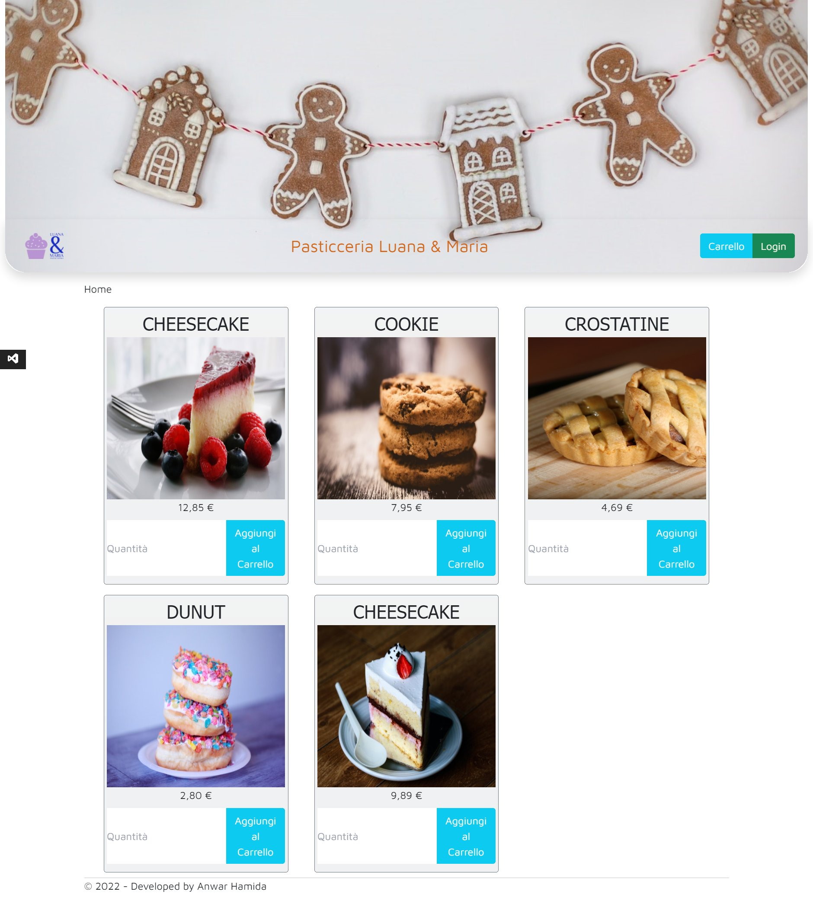
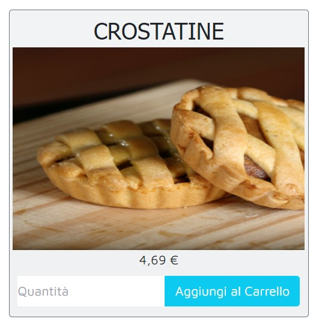

# Pasticceria 
> ##### | Asp.Net MVC
Esercizio

Il Software consiste in una pagina iniziale pubblica e accessibile da tutti.

In questa pagina vi sono tutti i prodotti disponibili e la possibilità di aggiungere una quantità del prodotto al carrello (*under construction*).

è anche presente il tasto per effettuare il login gli utenti già presenti nel database.

Una volta effettuato il Login si passa alla lista *privata* dei prodotti disponibili con le relative quantità e informazioni.

Da qui è possibile aggiungere, modificare, cancellare o visualizzare i dettagli di ogni prodotto.

Infine il tasto Aggiorna che serve a verificare "l'invecchiamento" dei prodotti e modificarne i prezzi in base ad esso.

